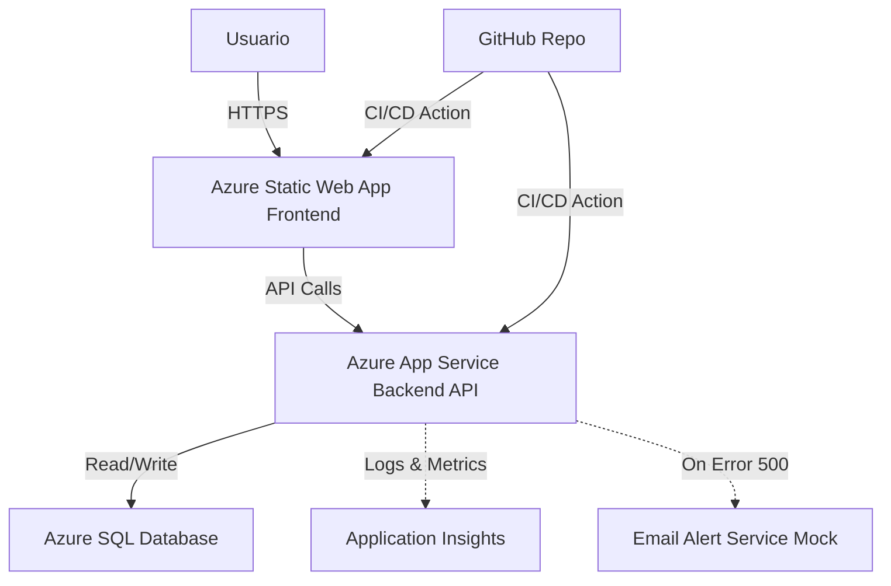

# Employee Management System - Backend API

A RESTful API built with ASP.NET Core 8.0 following Clean Architecture principles for managing employee records with advanced features like pagination, search, and statistics.

## 🏗️ Architecture

This project follows **Clean Architecture** with clear separation of concerns:

```
├── Domain/                 # Core business entities and interfaces
├── Application/            # Business logic, DTOs, and services
├── Infrastructure/         # Data access, repositories, and external services
└── employee-management-backend/   # API layer (Controllers, middleware)
```

### Azure Deployment Architecture



## 🚀 Features

- **CRUD Operations**: Create, Read, Update, and Delete employee records
- **Pagination**: Efficient data retrieval with customizable page size
- **Search**: Full-text search across employee names and emails
- **Statistics**: Real-time hiring statistics with month-over-month trends
- **CORS Support**: Configured for local and production frontend integration
- **Swagger UI**: Interactive API documentation
- **Exception Handling**: Global middleware for consistent error responses
- **Entity Framework Core**: Code-first approach with SQL Server

## 📋 Prerequisites

Before you begin, ensure you have the following installed:

- [.NET 8.0 SDK](https://dotnet.microsoft.com/download/dotnet/8.0) or higher
- [SQL Server](https://www.microsoft.com/en-us/sql-server/sql-server-downloads) (LocalDB, Express, or full version)
- [Visual Studio 2022](https://visualstudio.microsoft.com/) or [VS Code](https://code.visualstudio.com/) (optional, but recommended)
- [Git](https://git-scm.com/) (for cloning the repository)

## 🔧 Installation & Setup

### 1. Clone the Repository

```bash
git clone <repository-url>
cd BACKEND
```

### 2. Configure Database Connection

Open `employee-management-backend/appsettings.json` and update the connection string:

```json
{
  "ConnectionStrings": {
    "DefaultConnection": "Server=localhost;Database=EmployeeDB;Trusted_Connection=True;TrustServerCertificate=True;"
  }
}
```

**Connection String Options:**

- **Windows Authentication**: `Server=localhost;Database=EmployeeDB;Trusted_Connection=True;TrustServerCertificate=True;`
- **SQL Server Authentication**: `Server=localhost;Database=EmployeeDB;User Id=your_username;Password=your_password;TrustServerCertificate=True;`
- **LocalDB**: `Server=(localdb)\\mssqllocaldb;Database=EmployeeDB;Trusted_Connection=True;`

### 3. Restore Dependencies

```bash
dotnet restore
```

### 4. Apply Database Migrations

Create the database and apply migrations:

```bash
cd Infrastructure
dotnet ef database update --startup-project ../employee-management-backend
```

**Troubleshooting**: If you encounter migration issues, ensure:
- SQL Server is running
- Connection string is correct
- You have permissions to create databases

### 5. Run the Application

```bash
cd ../employee-management-backend
dotnet run
```

The API will start on:
- HTTPS: `https://localhost:7xxx`
- HTTP: `http://localhost:5xxx`

Check the console output for the exact URLs.

## 📚 API Documentation

Once the application is running, access Swagger UI at:

```
https://localhost:7xxx/swagger
```

### Available Endpoints

#### Employees

| Method | Endpoint | Description |
|--------|----------|-------------|
| GET | `/api/employees` | Get paginated list of employees with optional search |
| GET | `/api/employees/{id}` | Get employee by ID |
| POST | `/api/employees` | Create new employee |
| PUT | `/api/employees/{id}` | Update existing employee |
| DELETE | `/api/employees/{id}` | Delete employee |
| GET | `/api/employees/stats` | Get hiring statistics and trends |

#### Query Parameters (GET /api/employees)

- `page` (optional, default: 1): Page number
- `pageSize` (optional, default: 10): Number of items per page
- `search` (optional): Search term for filtering by name or email

### Example Requests

#### Get all employees (paginated)
```bash
GET /api/employees?page=1&pageSize=10
```

#### Search employees
```bash
GET /api/employees?search=john&page=1&pageSize=10
```

#### Create employee
```bash
POST /api/employees
Content-Type: application/json

{
  "firstName": "John",
  "lastName": "Doe",
  "email": "john.doe@example.com",
  "jobTitle": "Software Engineer",
  "hireDate": "2024-01-15"
}
```

#### Get statistics
```bash
GET /api/employees/stats
```

**Response:**
```json
{
  "recentHires": 10,
  "trend": {
    "value": 25.0,
    "isPositive": true
  }
}
```

## 🔑 Environment Variables (Production)

For production deployment, configure the following in Azure App Service or your hosting environment:

- `ConnectionStrings__DefaultConnection`: Database connection string
- `ConnectionStrings__ApplicationInsights`: Application Insights connection (optional)
- `FrontendUrl`: Frontend URL for CORS (e.g., `https://your-frontend.azurestaticapps.net`)

## 🧪 Testing

### Manual Testing with Swagger

1. Run the application: `dotnet run`
2. Navigate to Swagger UI: `https://localhost:7xxx/swagger`
3. Test each endpoint using the "Try it out" feature

### Testing Error Handling & Alert System

To test the exception handling middleware and email alert system, use the dedicated force-error endpoint:

```bash
GET /api/employees/force-error
```

This endpoint will:
- ✅ Throw a simulated critical error (HTTP 500)
- ✅ Trigger the exception handling middleware
- ✅ Log the error to Application Insights (if configured)
- ✅ Send a mock email alert

**Example using cURL:**
```bash
curl -X GET "https://localhost:7xxx/api/employees/force-error"
```

**Expected Response:**
```json
{
  "error": "🔥 PRUEBA TÉCNICA: Simulando un Error Crítico 500 para validar el sistema de alertas.",
  "timestamp": "2024-02-10T12:00:00Z"
}
```

### Future Enhancements

- Unit tests using xUnit
- Integration tests with in-memory database
- API endpoint tests

## 🗂️ Project Structure

```
BACKEND/
├── Domain/
│   ├── Entities/
│   │   └── Employee.cs              # Employee entity
│   └── Interfaces/
│       └── IEmployeeRepository.cs   # Repository contract
│
├── Application/
│   ├── DTOs/
│   │   ├── EmployeeDto.cs           # Employee data transfer object
│   │   ├── CreateEmployeeDto.cs     # Create/update DTO
│   │   └── EmployeeStatsDto.cs      # Statistics DTO
│   └── Services/
│       └── EmployeeService.cs       # Business logic layer
│
├── Infrastructure/
│   ├── Data/
│   │   └── AppDbContext.cs          # EF Core DbContext
│   ├── Repositories/
│   │   └── EmployeeRepository.cs    # Data access layer
│   ├── Services/
│   │   └── EmailService.cs          # Email service implementation
│   └── Migrations/                  # EF Core migrations
│
└── employee-management-backend/
    ├── Controllers/
    │   └── EmployeesController.cs   # API endpoints
    ├── Middleware/
    │   └── ExceptionHandlingMiddleware.cs  # Global error handling
    ├── Program.cs                   # Application entry point
    └── appsettings.json             # Configuration
```

## 🛠️ Technologies Used

- **Framework**: ASP.NET Core 8.0
- **ORM**: Entity Framework Core 9.0
- **Database**: SQL Server
- **API Documentation**: Swagger/OpenAPI (Swashbuckle)
- **Monitoring**: Application Insights (optional)
- **Architecture**: Clean Architecture / Onion Architecture

## 🔒 CORS Configuration

CORS is configured in `Program.cs`:

- **Development**: Allows `http://localhost:5173` and `http://localhost:3000`
- **Production**: Configured via `FrontendUrl` environment variable

## 📝 Common Issues & Solutions

### Issue: Database connection failed

**Solution**: 
- Verify SQL Server is running
- Check connection string in `appsettings.json`
- Ensure database user has proper permissions

### Issue: Migration not found

**Solution**:
```bash
cd Infrastructure
dotnet ef migrations add InitialCreate --startup-project ../employee-management-backend
dotnet ef database update --startup-project ../employee-management-backend
```

### Issue: Port already in use

**Solution**: 
- Change the port in `Properties/launchSettings.json`
- Or stop the process using the port: `netstat -ano | findstr :5000`

## 🤝 Contributing

1. Fork the repository
2. Create a feature branch: `git checkout -b feature/your-feature`
3. Commit your changes: `git commit -m 'Add some feature'`
4. Push to the branch: `git push origin feature/your-feature`
5. Open a Pull Request

## 📄 License

This project is part of a technical assessment for Kleios Technologies.

## 👥 Contact

For questions or issues, please contact the development team or open an issue in the repository.

---

**Last Updated**: February 2026  
**Version**: 1.0.0  
**Status**: Active Development
